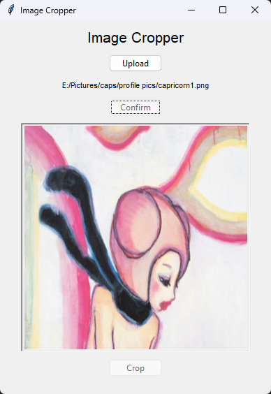

# Image Cropper!

This project serves the need to easily crop images which is done using [imageCrop.py](imageCrop.py). The state of development is documented below.

## Visuals
Intended look (design):

Previous look (25/11/2025 1):

Current look (25/11/2025 2):

The UI and functionality is implemented in [imageCrop.py](imageCrop.py). 